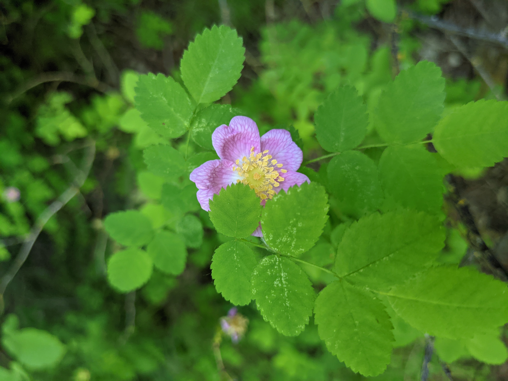

Native Plants of the Pacific Northwest

This project is a table of plants native to the Pacific Northwest, with common and scientific names, and a photo of each plant. I created this to practice html, css, and using React to set up an app. Check it out here: https://elitay152.github.io/plant-app/ 

